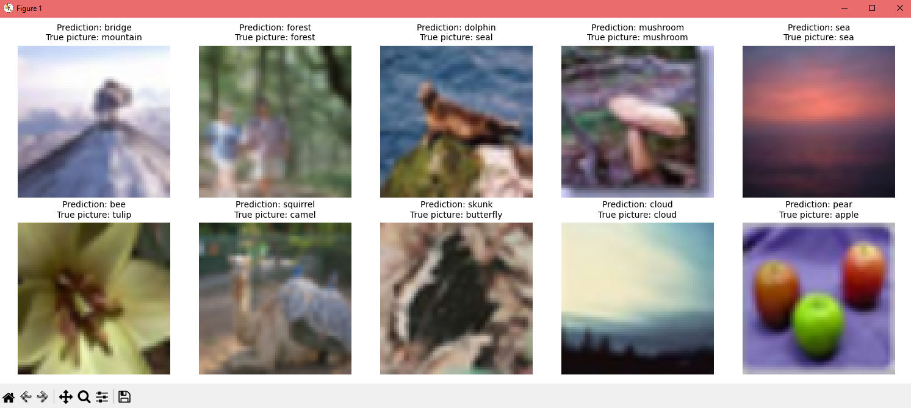

# **_Python Image Classifier with Neural Networks_**

## About
This project demonstrates a Convolutional Neural Network (CNN) — based image classifier built using TensorFlow and Keras. 
The model is trained on the CIFAR-100 dataset , which contains 100 fine-grained classes of everyday objects, animals, and scenes. 
This project showcases how to preprocess data, build a CNN architecture, apply data augmentation, and evaluate the model's performance.

### Key Features
* Dataset : CIFAR-100 dataset with 100 fine-grained classes.
* Model Architecture : A deep CNN with convolutional layers, batch normalization, dropout, and global average pooling for improved generalization.
* Data Augmentation : Random rotations, zooms, flips, and scaling to enhance model robustness.
* Training : Efficient training with early stopping and model checkpointing to save the best-performing model.
* Prediction : A utility function to classify new images and visualize predictions alongside ground truth labels.
​
> version: Mar 2025, created by Gleb 'Faitsuma' Kiryakov


## Project Structure

### Code Overview
1. Dataset Loading :
    * The CIFAR-100 dataset is loaded using TensorFlow's datasets module.
    * Images are resized to 64x64 pixels using TensorFlow's image processing utilities, and pixel values are normalized to the range [0, 1].
2. Model Architecture :
    * A sequential CNN model is defined with multiple convolutional layers, batch normalization, max-pooling, and dropout layers to prevent overfitting.
    * The final layer outputs logits for the 100 classes in CIFAR-100.
3. Data Augmentation :
    * A pipeline of random transformations (e.g., rotation, zoom, flip) is applied to the training data to improve model generalization.
4. Training :
    * The model is compiled with the Adam optimizer and sparse categorical cross-entropy loss.
    * Training is performed with callbacks for early stopping and saving the best model based on validation accuracy.
5. Prediction and Visualization :
    * A utility function classify_image predicts the class of a given image.
    * Another function show_images_with_predictions visualizes predictions alongside true labels for a batch of test images.


## How to Use

### Prerequisites
* Install the required dependencies:
```
pip install tensorflow matplotlib numpy pillow
```
### Running the Code
1. Clone this repository:
```
git clone https://github.com/Faitsumaru/images-ai-classifier
cd images-ai-classifier
```
2. Run the script:
```
python main.py
```
3. Visualize Results:
* After training, the script will display predictions for a sample of test images, showing both predicted and true labels.


## Preshow

<div align="center">
    
</div>


## Documentation

* CIFAR-100 dataset: https://www.cs.toronto.edu/~kriz/cifar.html
* Git: https://githowto.com/ru
* TensorFlow: https://www.tensorflow.org/api_docs
* Keras: https://keras.io/api/
* NumPy: https://numpy.org/doc/
* Matplotlib: https://matplotlib.org/stable/contents.html
* Pillow: https://pillow.readthedocs.io/en/stable/
* Python: https://docs.python.org/3/
* Early Stopping: https://www.tensorflow.org/api_docs/python/tf/keras/callbacks/EarlyStopping
* Model Checkpointing: https://www.tensorflow.org/api_docs/python/tf/keras/callbacks/ModelCheckpoint
* Data Augmentation: https://www.tensorflow.org/tutorials/images/data_augmentation
* Convolutional Neural Networks: https://en.wikipedia.org/wiki/Convolutional_neural_network